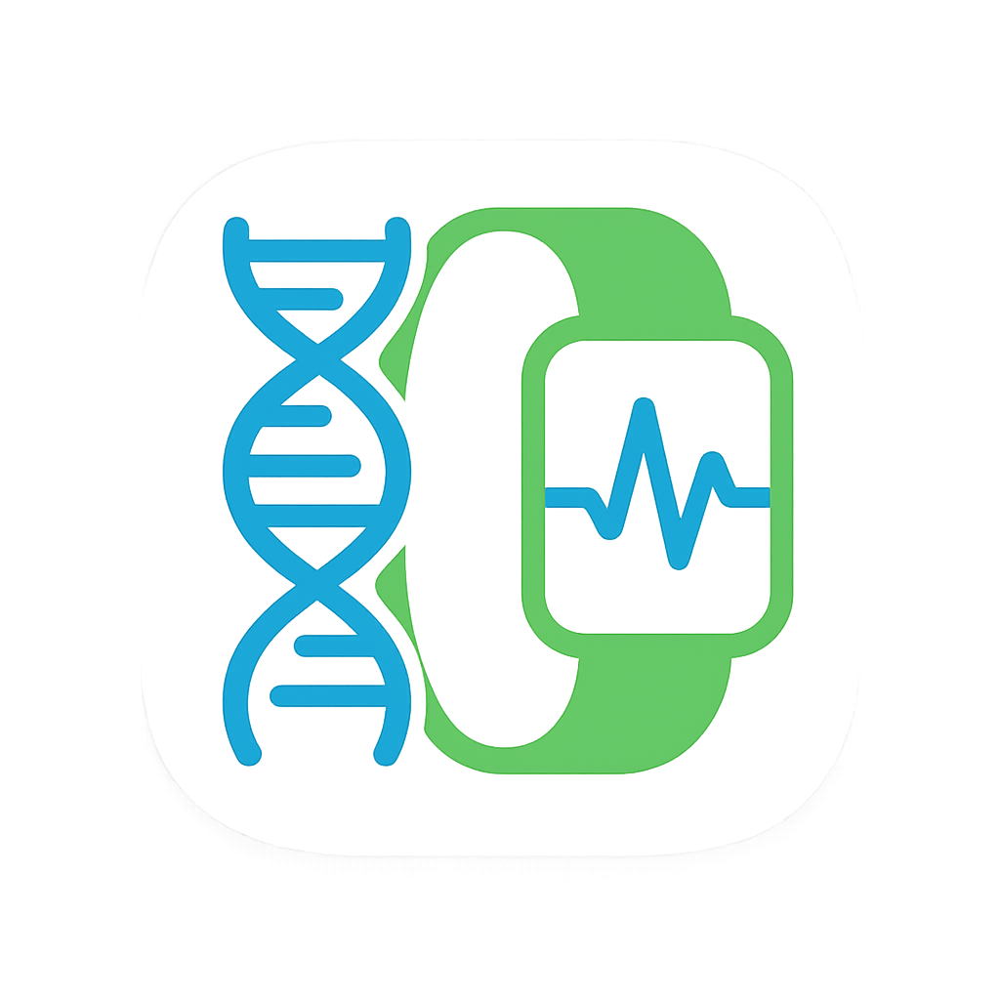

# 💊 BioTrack SmartBand Desktop App

Desktop application for real-time biometric monitoring using smartbands and ESP32.  
Developed as part of the ** Biotechnology Competition** project.



---

## 🚀 Features

- 🔐 Firebase-based user authentication (Sign In / Sign Up / Reset)
- 📈 Real-time biometric tracking:
  - Glucose (mg/dL)
  - pH Level
  - Oxygen Saturation (%)
- 📊 Live charts with Matplotlib
- 💾 Local SQLite logging & CSV export
- 🧪 Simulated data mode for demo/testing
- 🛠 Configurable thresholds and ESP32 IP

---

## 🧠 Technologies Used

- Python 3.10+
- PyQt5
- Matplotlib
- SQLite3
- Firebase Authentication API
- RESTful communication with ESP32

---

## 🗂️ Folder Structure

biotrack_desktop_app/
├── main.py
├── config.py
├── auth/
│ └── auth_service.py
├── data/
│ ├── database.py
│ └── models.py
├── threads/
│ └── esp_thread.py
├── ui/
│ ├── dashboard.py
│ ├── history.py
│ ├── login.py
│ ├── settings.py
│ └── widgets.py
├── db/
│ └── biotrack_data.db
├── resources/
│ └── bioicon.png
└── README.md

---

## 📦 Installation

```bash
git clone https://github.com/burceburakgazi/biotrack_desktop_app.git
cd biotrack_desktop_app
pip install -r requirements.txt
python main.py

🧪 Simulated Mode
If no ESP32 is detected, the app automatically switches to a fake data thread for testing.
This is ideal for UI demos and development.

🏆 Project Background
This project was developed as part of our university team's participation in the
TEKNOFEST Biotechnology Innovation Track.
Our aim is to provide continuous wound monitoring through a wearable smartband system.

👤 Author
Burçe Burakgazi

2nd Year Computer Engineering Student – Manisa Celal Bayar University
GitHub: @burceburakgazi

